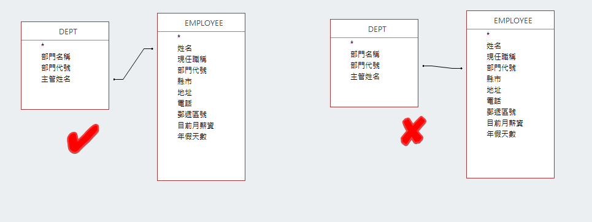
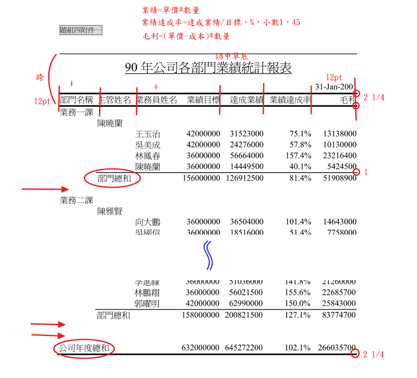
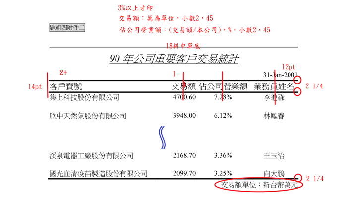
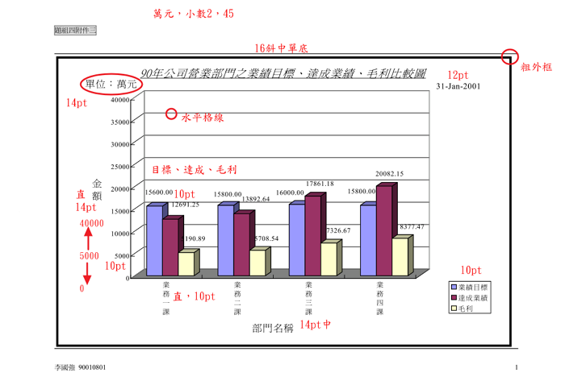
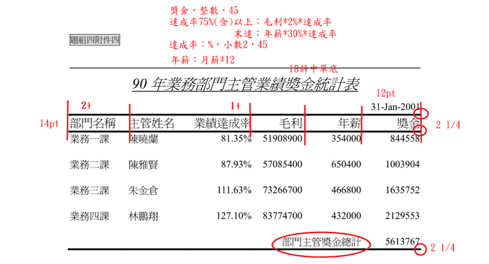
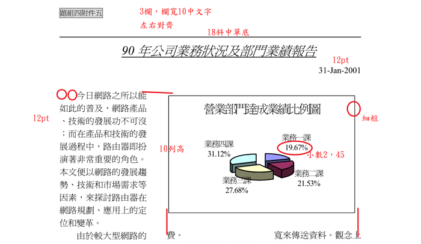

## 前置作業

### 產生 5 個 word 檔

1. 版面設定 (邊界)
1. 上下邊線 (頁面框線，1pt 寬)
1. 頁首、頁尾 (三欄格式，沒用的要刪除)
1. 存檔 (檔名 50王大同4-1、50王大同4-2、50王大同4-3、50王大同4-4、50王大同4-5，副檔名會自動加上 .docx)
1. 依據不同設定，更改其它 4 個檔案

### 資料：從 XML → Access → Excel

1. 開啟 Access ，新增檔案，命名為 50王大同no4.accdb
1. 匯入 XML 資料庫檔案 (看清楚檔名)
1. 修改資料表的「資料類型」 (將應該是數值的資料改成數字資料類型)
1. 建立 → 查詢建立 → 新增剛剛所匯入的資料表
    - data-1 查詢表 (銷售，以SALES為中心)，共 115 筆資料
    - data-2 查詢表 (主管年薪，以DEPT為中心。為什麼關連是用主管姓名？)，共 16 筆資料 
1. 複製 data-1、data-2 -> 在 Excel 中貼上 -> 字型調大一點12pt -> 調整欄寬、列高 -> 工作表命名為 data-1、data-2 -> 存檔 50王大同no4.xlsx

:::tip[想一想]
在製作 data-2 查詢表時，你需要想一想：為什麼這裡是用 **主管姓名** 連結 **姓名** ；而不是用 部門代號 連結 部門代號

:::

## 附件一

### 看題目

- 看題目說明
- 看附件內容
- 做成圖片說明

### Excel 資料

1. 工作表 1
   - 在 data-1 內，插入樞紐分析表，命名為 1
   - 依照題意，拉入欄位。想想：**業績目標** 放那裡、業績達成率等等自己做。
   - 設定取消小計、排序
1. 工作表 ok1
   - 將資料複製到新工作表，命名為 ok1
   - 記得從標題列開始做起
   - 四捨五入公式：round
   - 格式設定：格式看清楚，沒有會計符號 (3位1撇)
   - 公司年度總和	先合併儲存格，再調整最適欄寬
1. 資料檢查：386 352

### Word 操作

1. 開啟 50王大同4-1.docx
1. 將 50王大同4.xlsx 工作表 ok1 的資料拷貝到 50王大同4-1.docx
1. 如果需要：顯示輔助線、取消表格框線及網底
1. 字型設定
1. 表格大小：滑鼠右鍵 → 自動調整 → 自動調整成視窗大小
1. 表格欄位對齊方式
1. 插入最前面 2 列 → 輸入文字 → 格式
1. 表格格線格式
1. 重複標題列
1. 取消輔助線，檢查結果

## 附件二

### 看題目

- 看題目說明
- 看附件內容
- 做成圖片說明

### Excel 資料

1. 工作表 2
   - 在 data-1 內，插入樞紐分析表，命名為 2
   - 到 工作表 2，加入樞鈕分析表欄位
   - 取消小計
   - 欄位設定 → 版面配置與列印 → 重複項目標籤
1. 工作表 ok2
   - 將資料複製到新工作表，命名為 ok2
   - 記得從標題列開始做起
   - 佔公司營業額設定為 百分比、小數2位
   - 依 佔公司營業額 遞減排序，將少於 3% 的資料列刪除
   - 交易額 除 10000，設定數值小數2位
   - 插入空白列
   - 不要忘了 交易額單位：新台幣萬元
1. 資料檢查：309

## 附件三

### 看題目

- 看題目說明
- 看附件內容
- 做成圖片說明

### Excel 資料

1. 工作表 3
   - 從 ok1 選取資料
   - 插入工作表，貼上資料，命名 3
   - 整理所需資料
1. 工作表 ok3
   - 選取資料 → 插入 → 立體直條體 → 移動圖表 → 命名為 ok3
   - 版面設定：邊界全部設為 3 cm (和 word 的文件一樣)
   - 圖表區格式 → 字型
   - 圖表選項，該有的項目先叫出來
   - 順時鐘做格式設定
   - 拉一下 資料標籤

## 附件四

### 看題目

- 看題目說明
- 看附件內容
- 做成圖片說明

### Excel 資料

1. 工作表 ok4
   - 從 工作表 3，複製資料到 ok4
   - 到 工作表 data-2，複製資料到 ok4
   - 整理資料，從標題列開始做起
   - 業績達成率：百分比 小數 2 位，所以要四捨五入到第 4 位
   - 選擇性貼上
   - 資料很少，業績獎金直接分 2 個公式算
   - 排序
   - 不要忘了 部門主管獎金總計
   - 插入空白列 
1. 資料檢查：1728

:::tip[想一想為什麼]
獎金要針對達成率乘以毛利或年薪乘達成率計算。但是達成率要四捨五入。千萬不要以為顯示上有四捨五入就是真得四捨五入，一定要自己用公式算。

ok1 中的達成率是到百分比小數第1位，而此處是百分比小數第2位
:::

## 附件五

### 看題目

- 看題目說明
- 看附件內容
- 做成圖片說明

### Excel 資料

1. 工作表 ok5
   - 從 工作表 3，複製資料到 ok5
   - 插入圖表
   - 設定圖表、字型記得改
1. 資料檢查：業務四課 2705

### Word 操作

1. 插入文字檔
1. 段落整理 (如丙級方法)
1. 字型、段落 (左右對齊、第一行2個字、最小行高18點)
1. 標題
1. 欄
1. 圖表，與第二欄、第三欄距離 1 列
