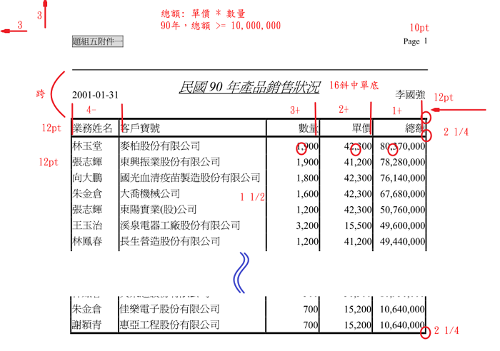
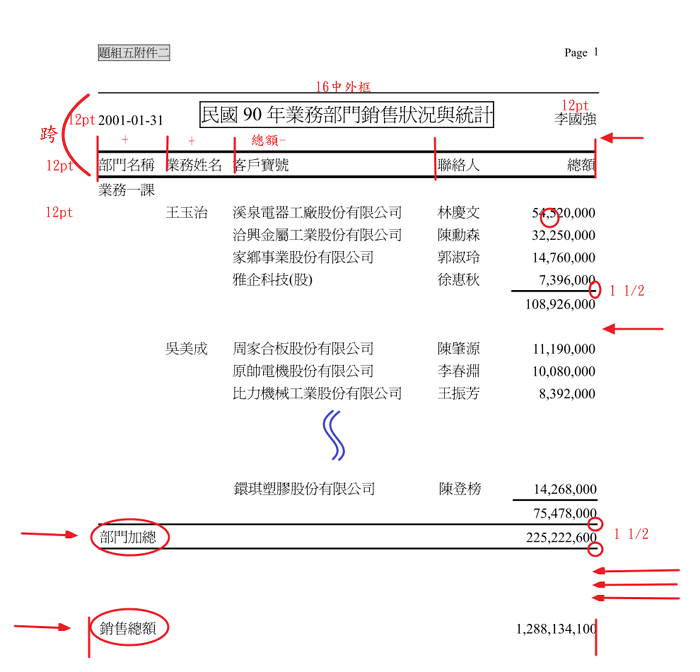
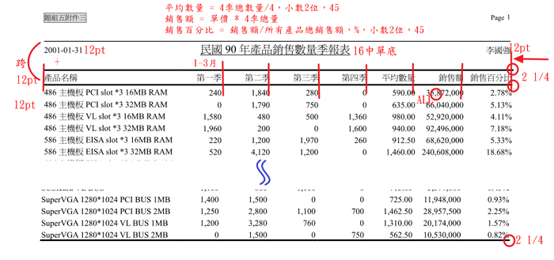
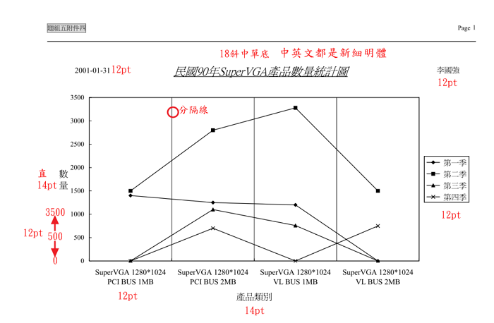
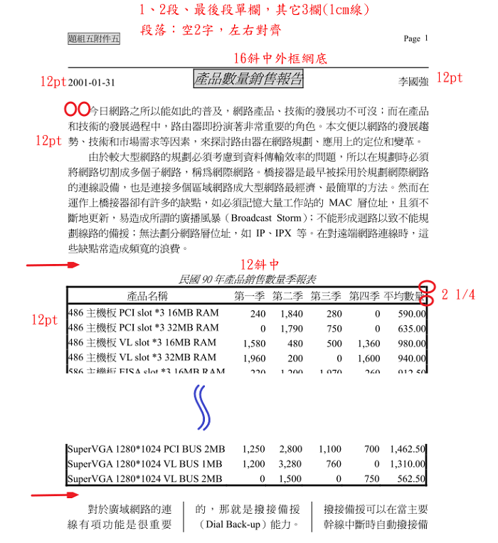

## 前置作業

### 產生 5 個 word 檔

1. 版面設定 (邊界)
1. 上下邊線 (頁面框線，1pt 寬)
1. 頁首、頁尾 (三欄格式，沒用的要刪除)
1. 存檔 (檔名 50王大同5-1、50王大同5-2、50王大同5-3、50王大同5-4、50王大同5-5，副檔名會自動加上 .docx)
1. 依據不同設定，更改其它 4 個檔案

### 資料：從 XML → Access → Excel

1. 開啟 Access ，新增檔案，命名為 50王大同no5.accdb
1. 匯入 XML 檔案 (看清楚檔名)
1. 修改資料表的「資料類型」 (將應該是數值的資料改成數字資料類型)
1. 建立 → 查詢建立 → 新增剛剛所匯入的資料表
1. 關聯 (以 SALES2 為中心)
1. 加入欄位
1. 完成 (資料共 93 筆)，存成 data-1
1. 複製 data-1 → 在 Excel 中「**選擇性貼上**」 → 調整欄寬、列高 → 工作表命名為 data-1 → 存檔 50王大同no5.xlsx

## 附件一

### 看題目

- 看題目說明
- 看附件內容
- 做成圖片說明

### Excel 資料

1. 工作表 ok1
   - 拷貝資料到工作表 ok1：業務姓名、客戶寶號、數量、單價、總額
   - 排序：總額遞減 → 單價遞減 → 數量遞減 → 業務姓名遞增
   - 篩選總額大於 10,000,000 之資料 (刪除後面比較小的列)
   - 格式設定：千分位，沒有小數
1. 資料檢查：1221 太豐 24577

### Word 操作

1. 開啟 50王大同5-1.docx
1. 將 50王大同no5.xlsx 工作表 ok1 的資料拷貝到 50王大同5-1.docx
1. 字型設定
1. 表格大小：滑鼠右鍵 → 自動調整 → 自動調整成視窗大小
1. 表格欄位對齊方式
1. 插入最前面 2 列 → 輸入文字 → 格式
1. 表格格線：直的 1 1/2 ，橫的標題 2 1/4 ，另外用畫筆補
1. 重複標題列

## 附件二

### 看題目

- 看題目說明
- 看附件內容
- 做成圖片說明

### Excel 資料

1. 工作表 2
   - 到工作表 data-1 資料上任一處 → 插入樞鈕分析表 → 命名為 2
   - 到 工作表 2，在樞鈕分析表內，按滑鼠右鍵 → 「樞鈕分析選項」 → 「顯示」→「古典樞鈕分析表版面配置…」
   - 到 工作表 2，加入樞鈕分析表欄位 **請掌握 1 2 3 欄位原則**
   - 在 「客戶寶號」上按右鍵 → 欄位設定 → 小計：無
   - 在 「客戶寶號」上按右鍵 → 排序 → 更多排序選項 → 加總的總額
1. 工作表 ok2
   - 將資料複製到新工作表，命名為 ok2
   - ok2 格式設定 (最後請記得調整最適欄寬)
1. 資料檢查：1314 820

### Word 操作

1. 開啟 50王大同5-2.docx
1. 將 50王大同no5.xlsx 工作表 ok2 的資料拷貝到 50王大同5-2.docx
1. 取消表格框線及網底
1. 字型設定
1. 表格大小：滑鼠右鍵 → 自動調整 → 自動調整成視窗大小
1. 表格欄位對齊方式
1. 插入最前面 2 列 → 輸入文字 → 格式
1. 表格格線：標題上下 2 1/4、業務總計 1 1/2、部門加總 1 1/2
1. 重複標題列

## 附件三

### 看題目

- 看題目說明
- 看附件內容
- 做成圖片說明

### Excel 資料

1. 工作表 3
   - 到工作表 data-1 資料上任一處 → 插入樞鈕分析表 → 命名為 3
   - 到 工作表 3，加入樞鈕分析表欄位 (產品名稱、銷售月、銷售量)
   - 對銷售月做群組
   - 空白要顯示為 0：樞紐分析表選項 → 版面配置與格式 → 若為空白儲存格，顯示為…
1. 工作表 3-1
   - 同 3 ，做一張 3-1 的工作表，欄位為 (產品名稱、總額、總額-百分比)
   - 在第 2 個總額按滑鼠右鍵 → 值的顯示方式 → 總計百分比
1. 工作表 ok3
   - 新增一張 ok3 工作表，將 3、3-1 的資料複製到 ok3
   - 欄位名稱
   - 欄位資料計算 (平均：average)
   - 數字格式
1. 資料檢查： 0.64%

### Word 操作¶

## 附件四

### 看題目

- 看題目說明
- 看附件內容
- 做成圖片說明

### Excel 資料

1. 工作表 4
   - 從 ok3 選取資料
   - 插入工作表，貼上資料
1. 工作表 ok4
   - 選取資料 → 插入 → 圖表 → 移動圖表 (ok4)
   - 版面設定：邊界全部設為 3 cm (和 word 的文件一樣)
   - 新增圖表項目：看需要哪些東西
   - 圖表區格式 → 字型
   - 順時鐘做格式設定

### Word 操作

1. 按滑鼠右鍵 → 圖片

## 附件五

### 看題目

- 看題目說明
- 看附件內容
- 做成圖片說明

### Word 操作

1. 插入文字檔
1. 段落整理 (如丙級方法)
1. 字型、段落
1. 標題
1. 表格（貼上、框線及網底、字型、自動調整成視窗大小）
1. 欄
