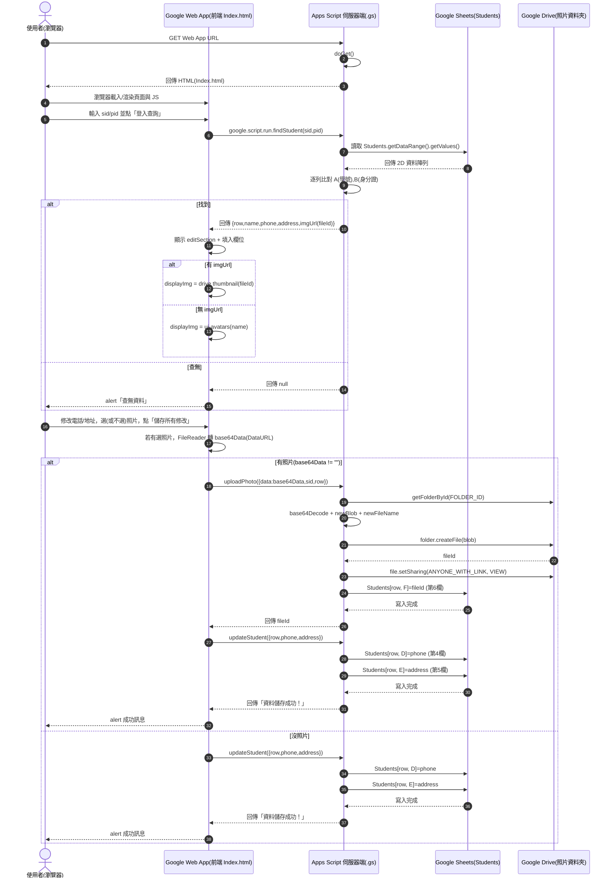

# Google Apps Script (GAS) 實務教學：學生資料管理系統

這份講義將帶領你從零開始，利用 Google Apps Script 將試算表變成一個具有「資料查詢」、「動態修改」與「照片上傳」功能的網頁應用程式（Web App）。

---

## 一、準備工作（資料庫與雲端空間）

在寫程式之前，我們需要準備好資料存放的地方。

### 1. Google 試算表設定

1. 建立新試算表，分頁命名為 `Students`（注意大小寫）。
2. 第一列標題（欄位名稱），由A欄開始： `學號	身分證	姓名	電話	住址	照片ID`
3. 手動填入一兩筆測試資料以供查詢。

```
學號	身分證	姓名	電話	住址	照片ID
410001	A123456789	王小明	0912345678	彰化縣二林鎮中正路1號	
410002	B234567890	陳美玲	0922333444	彰化縣二林鎮仁愛路12號	
410003	C345678901	林志豪	0933555666	彰化縣二林鎮文化路88號	
410004	D456789012	張雅婷	0988777666	彰化縣二林鎮和平路3段25號	
410005	E567890123	李冠廷	0977666555	彰化縣二林鎮光復路66號	
410006	F678901234	黃怡君	0911222333	彰化縣二林鎮民生路101號	
410007	G789012345	吳承翰	0922444555	彰化縣二林鎮建國路9號	
410008	H890123456	蔡佩蓉	0933666777	彰化縣二林鎮成功路50號	
410009	I901234567	劉家豪	0955888999	彰化縣二林鎮新生路77號	
410010	J012345678	鄭舒涵	0966777888	彰化縣二林鎮忠孝路18號	
```

---

### 2. 雲端硬碟設定

1. 建立一個資料夾用來存放學生上傳的照片。
2. 點開資料夾，從網址列複製 ID（位於 `folders/` 後的一串隨機亂碼）。本範例 ID：`1-LYuaR1PoeoxnBfIrawRva0ou71GPsUC`

---

### 3. 開啟 Google Apps Script

1. 回到剛剛建立的 Google 試算表。
2. 點選上方選單：**擴充功能（Extensions）→ Apps Script**。
3. 進入腳本編輯器後：

* 將專案命名（例如：`StudentWebApp`）
* 確認左側有一個預設檔案 `程式碼.gs`（若名稱不同也沒關係）

---


## 二、後端邏輯：程式碼.gs

GAS 的後端語言基於 JavaScript。它負責直接與 Google 服務溝通。請將以下程式碼貼入 `程式碼.gs` 檔案中。

```js
/**
 * 檔案名稱：code.gs
 * 功能：伺服器端邏輯處理
 */

const FOLDER_ID = '1-LYuaR1PoeoxnBfIrawRva0ou71GPsUC';

// 網頁進入點
function doGet() {
  return HtmlService.createHtmlOutputFromFile('Index')
    .setTitle('學生資料管理系統')
    .setXFrameOptionsMode(HtmlService.XFrameOptionsMode.ALLOWALL);
}

// 查詢學生功能
function findStudent(sid, pid) {
  const ss = SpreadsheetApp.getActiveSpreadsheet();
  const studentSheet = ss.getSheetByName('Students');
  
  if (!studentSheet) return { error: "找不到工作表" };

  const data = studentSheet.getDataRange().getValues();
  
  for (let i = 1; i < data.length; i++) {
    if (data[i][0].toString().trim() === sid.trim() && data[i][1].toString().trim() === pid.trim()) {
      return {
        row: i + 1,
        name: data[i][2],
        phone: data[i][3],
        address: data[i][4],
        imgUrl: data[i][5] || ""
      };
    }
  }
  return null;
}

// 照片上傳功能
function uploadPhoto(obj) {
  try {
    const folder = DriveApp.getFolderById(FOLDER_ID.trim());
    const contentType = obj.data.substring(5, obj.data.indexOf(';'));
    const bytes = Utilities.base64Decode(obj.data.split(',')[1]);
    
    // 檔名設定：學號.副檔名
    const extension = contentType.split('/')[1] || "jpg";
    const newFileName = obj.sid + "." + extension;
    
    const blob = Utilities.newBlob(bytes, contentType, newFileName);
    const file = folder.createFile(blob);
    file.setSharing(DriveApp.Access.ANYONE_WITH_LINK, DriveApp.Permission.VIEW);
    
    const sheet = SpreadsheetApp.getActiveSpreadsheet().getSheetByName('Students');
    sheet.getRange(Number(obj.row), 6).setValue(file.getId());
    
    SpreadsheetApp.flush();
    return file.getId();
  } catch (e) {
    return "Error: " + e.toString();
  }
}

// 更新文字資料功能
function updateStudent(formData) {
  try {
    const sheet = SpreadsheetApp.getActiveSpreadsheet().getSheetByName('Students');
    const targetRow = Number(formData.row);
    sheet.getRange(targetRow, 4).setValue(formData.phone);   
    sheet.getRange(targetRow, 5).setValue(formData.address);
    return "資料儲存成功！";
  } catch (e) {
    return "Error: " + e.toString();
  }
}
```

---

## 三、前端介面：Index.html

前端負責呈現美觀的畫面。請在 GAS 專案中新增一個 HTML 檔案，命名為 `Index`。

```html
<!DOCTYPE html>
<html>
  <head>
    <base target="_top">
    <meta charset="UTF-8">
    <style>
      body { font-family: "Microsoft JhengHei", sans-serif; background: #f0f2f5; display: flex; justify-content: center; padding: 20px; }
      .card { background: white; padding: 25px; border-radius: 12px; box-shadow: 0 4px 15px rgba(0,0,0,0.1); width: 100%; max-width: 400px; }
      h2 { color: #1a73e8; text-align: center; }
      .form-group { margin-bottom: 15px; }
      label { display: block; margin-bottom: 5px; font-weight: bold; color: #555; }
      input[type="text"] { width: 100%; padding: 10px; border: 1px solid #ddd; border-radius: 6px; box-sizing: border-box; }
      button { width: 100%; padding: 12px; background: #1a73e8; color: white; border: none; border-radius: 6px; cursor: pointer; font-size: 16px; transition: 0.3s; }
      button:hover { background: #1557b0; }
      #editSection { display: none; margin-top: 20px; padding-top: 20px; border-top: 2px solid #eee; }
      .profile-img { width: 120px; height: 120px; border-radius: 50%; display: block; margin: 10px auto; object-fit: cover; border: 3px solid #eee; background: #fafafa; }
      .loading { text-align: center; color: #666; display: none; }
    </style>
  </head>
  <body>

  <div class="card">
    <h2>學生資料填報系統</h2>
    
    <div id="searchSection">
      <div class="form-group"><label>學號</label><input type="text" id="sid" placeholder="請輸入學號"></div>
      <div class="form-group"><label>身分證字號</label><input type="text" id="pid" placeholder="請輸入身分證"></div>
      <button onclick="search()">登入查詢</button>
    </div>

    <div id="loading" class="loading">⚙️ 處理中...</div>

    <div id="editSection">
      <div style="text-align:center;">
        
        <input type="file" id="photoFile" accept="image/*" onchange="previewFile()">
      </div>
      <hr>
      <input type="hidden" id="studentRow">
      <div class="form-group"><label>姓名</label><div id="studentName" style="background:#f8f9fa; padding:10px; border-radius:5px;"></div></div>
      <div class="form-group"><label>聯絡電話</label><input type="text" id="studentPhone"></div>
      <div class="form-group"><label>通訊住址</label><input type="text" id="studentAddress"></div>
      <button id="saveBtn" onclick="update()">儲存所有修改</button>
    </div>
  </div>

  <script>
    let base64Data = "";

    function search() {
      const sid = document.getElementById('sid').value;
      const pid = document.getElementById('pid').value;
      if(!sid || !pid) return alert("欄位不能為空");

      document.getElementById('loading').style.display = 'block';
      
      google.script.run.withSuccessHandler(function(res) {
        document.getElementById('loading').style.display = 'none';
        if (res) {
          document.getElementById('editSection').style.display = 'block';
          document.getElementById('studentRow').value = res.row;
          document.getElementById('studentName').innerText = res.name;
          document.getElementById('studentPhone').value = res.phone;
          document.getElementById('studentAddress').value = res.address;
          
          document.getElementById('displayImg').src = res.imgUrl ?
            "https://drive.google.com/thumbnail?id=" + res.imgUrl + "&sz=w300" :
            "https://ui-avatars.com/api/?name=" + res.name;
        } else {
          alert("查無資料，請檢查學號與身分證。");
        }
      }).findStudent(sid, pid);
    }

    function previewFile() {
      const file = document.getElementById('photoFile').files[0];
      const reader = new FileReader();
      reader.onloadend = function() {
        document.getElementById('displayImg').src = reader.result;
        base64Data = reader.result;
      };
      if (file) reader.readAsDataURL(file);
    }

    function update() {
      const row = document.getElementById('studentRow').value;
      const sid = document.getElementById('sid').value;
      const btn = document.getElementById('saveBtn');
      
      btn.disabled = true;
      document.getElementById('loading').style.display = 'block';
      
      if (base64Data) {
        google.script.run.withSuccessHandler(() => saveTextOnly(row))
          .uploadPhoto({ data: base64Data, sid: sid, row: row });
      } else {
        saveTextOnly(row);
      }
    }

    function saveTextOnly(row) {
      const data = {
        row: row,
        phone: document.getElementById('studentPhone').value,
        address: document.getElementById('studentAddress').value
      };
      google.script.run.withSuccessHandler(function(msg) {
        document.getElementById('loading').style.display = 'none';
        document.getElementById('saveBtn').disabled = false;
        alert(msg);
      }).updateStudent(data);
    }
  </script>
  </body>
</html>
```

---

## 四、部署步驟（Deployment）

1. 新增部署：點擊右上角 **「部署」 > 「新增部署」**
2. 類型：選擇 **「網頁應用程式」**
3. 設定參數：
  * **執行身分：** 我（Me）
  * **誰有存取權：** 任何人（Anyone）
4. 授權流程：
  * 點擊部署後按「核對權限」
  * 選擇帳號
  * 點擊「進階（Advanced）」
  * 點擊「前往專案（unsafe）」
  * 點擊「允許（Allow）」
5. 完成：複製產生的「網頁應用程式網址」分享給學生。

---

## 五、課後挑戰

* **美化介面：** 更改 CSS 讓顏色更接近學校主題
* **欄位增加：** 在試算表中增加「個人專長」欄位並在網頁顯示
* **防呆機制：** 檢查電話號碼是否為數字

✅ 祝大家開發順利！

---

## 六、執行流程（解說 + 序列圖）

### 0. 這個 Web App 的核心概念（前端 vs 後端）

* **前端（Index.html）**：跑在使用者的瀏覽器，負責 UI 顯示、輸入、按鈕事件。
* **後端（Code.gs）**：跑在 Google 伺服器（Apps Script 執行環境），負責讀寫 **Google Sheets / Google Drive**。
* **溝通方式**：前端用 `google.script.run` 呼叫後端函式（例如 `findStudent()`、`uploadPhoto()`、`updateStudent()`）。

> 你的部署設定是「執行身分：我（Me）」，所以後端讀寫 Sheets/Drive 時是用 **你的帳號權限**。

### 1. 使用者開啟網址：doGet() 的流程

1. 使用者開啟 Web App URL
2. Google 觸發 `doGet()`
3. `doGet()` 回傳 `Index.html`
4. 瀏覽器載入頁面並執行前端 JavaScript

### 2. 查詢學生：findStudent() 的流程

1. 使用者輸入學號/身分證後按「登入查詢」
2. 前端呼叫 `google.script.run.findStudent(sid, pid)`
3. 後端讀取 `Students` 工作表資料並逐列比對
4. 找到則回傳 `{row, name, phone, address, imgUrl}`
5. 前端把資料顯示在畫面上（照片用 Drive thumbnail 或預設頭像）

### 3. 儲存修改：updateStudent() / uploadPhoto() 的流程

* **沒選照片**：直接呼叫 `updateStudent()` 更新電話/住址
* **有選照片**：先呼叫 `uploadPhoto()` 上傳照片並把檔案 ID 寫回 F 欄，再呼叫 `updateStudent()` 更新電話/住址

### 4. Mermaid 序列圖（完整流程）




