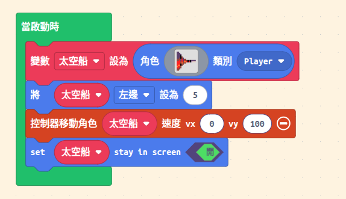
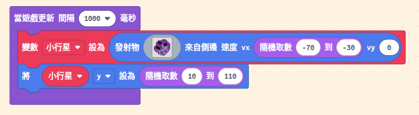
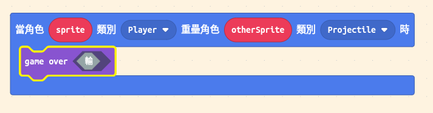
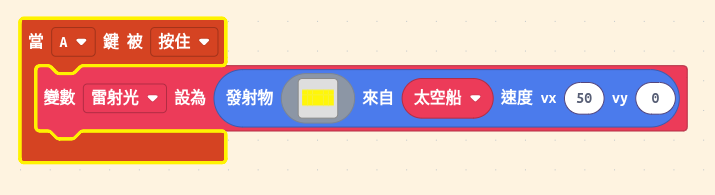
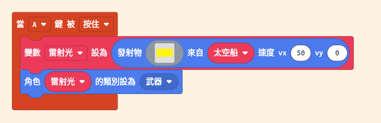
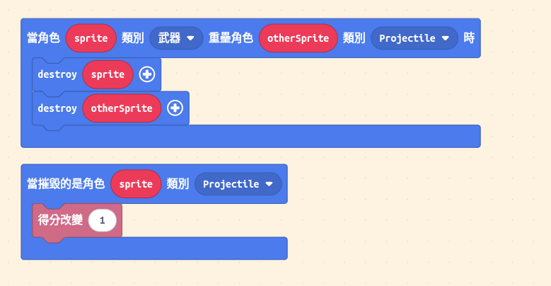

## 隕石危機規格表

| 項目         | 規格                                                         |
| :----------- | :----------------------------------------------------------- |
| **遊戲名稱** | 太空戰艦：隕石危機（Space Blaster）                          |
| **遊戲類型** | 射擊遊戲（Shoot 'em up）                                     |
| **開發平台** | Game:Bit 2.8 吋遊戲開發擴展板、Microsoft MakeCode Arcade     |
| **遊戲角色** | 太空船、雷射光、隕石（小行星）                               |
| **遊戲目標** | 操控太空船發射雷射，擊碎隕石以獲得分數，避免被隕石撞擊       |
| **基本玩法** | 玩家用方向鍵移動太空船，用 A 鍵發射雷射；每擊中隕石可得分    |
| **難度提升** | 逐漸增加隕石生成速度與下落速度；加入限量彈藥或生命值倒數機制 |
| **額外挑戰** | 加入隕石分裂、B 鍵可用的特殊武器或護盾                       |

## 實作

### 太空船

1. 先設定好太空船角色
1. 把太空船放到畫面左邊
1. 控制太空船的移動
   

:::tip[想一想]

- 限制太空船只能在畫面左邊移動
- 太空船只能上下移動
  :::

### 隕石（小行星）

1. 設定好隕石角色
1. 讓隕石從畫面右邊出現，並往左移動
1. 每隔一段時間就出現一個隕石
   

:::tip[想一想]

- 隕石的速度如何設定？
- 隕石的位置如何設定？
  :::

### 被隕石撞到

1. 當太空船碰到隕石時，遊戲結束
   

:::tip[想一想]

- 如何讓遊戲結束？
- 如何讓太空船閃爍？
- 如何讓隕石消失？
- 如何讓遊戲重新開始？
- 如何讓太空船有生命值？
  :::

### 雷射光

1. 設定好雷射光角色
1. 按 A 鍵發射雷射光
   

:::caution[注意]
雷射光一射出就死了，怎麼辦？

因為我們的小行星是 projectile 類型的角色，雷射光也是，但是前面我們已經設定了太空船碰到 projectile 類型會死掉，所以要把雷射光設成別種類型。
:::

:::tip[想一想]

- 如何讓雷射光從太空船的位置發射？
- 如何讓雷射光往右移動？
- 如何讓雷射光消失？
- 如何限制雷射光的數量？
- 如何讓雷射光有音效？
- 如何讓雷射光有動畫？
- 如何讓雷射光有不同的顏色？
- 如何讓雷射光有不同的形狀？
- 如何讓雷射光有不同的速度？
  :::

### 擊中隕石

1. 當雷射光碰到隕石時，隕石消失並加分
   

:::caution[注意]
注意銷毀的是什麼！
:::

:::tip[想一想]

- 如何讓隕石消失？
- 如何讓雷射光消失？
- 如何讓分數增加？
- 如何讓隕石有音效？
- 如何讓隕石有動畫？
  :::

### 提升難度

1. 逐漸增加隕石生成速度與下落速度
1. 加入限量彈藥或生命值倒數機制
1. 加入隕石分裂
1. B 鍵可用的特殊武器或護盾
1. 更多挑戰等你來設計！
