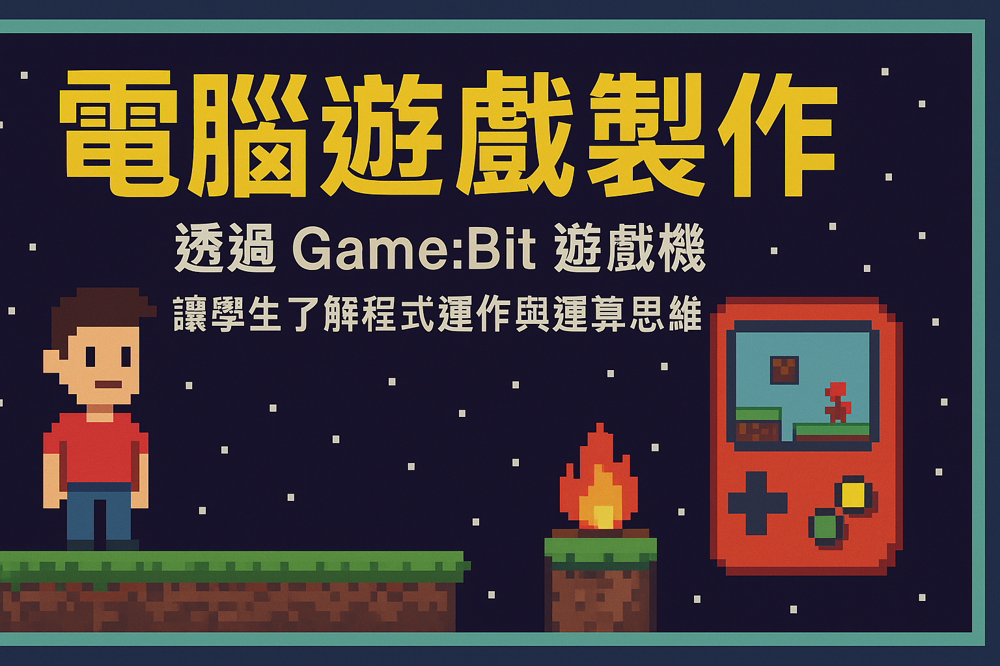

這是 114 學年，資處三甲的「電腦遊戲製作」課程。透過 Game:Bit 遊戲機，讓學生從實作中了解程式運作與運算思維，從製作簡單的復古遊戲，一窺遊戲設計的基本概念。

進度：

1. 簡介
   - [Microsoft MakeCode Arcade](https://arcade.makecode.com/)
   - [Game:Bit 2.8 吋 遊戲開發擴展板](https://www.icshop.com.tw/pages/circuspi-gamebit)
   - [Building Games In MakeCode Arcade - YouTube](https://www.youtube.com/playlist?list=PLllmBIfSE6xyHn7CwlL-Ld1s4Pe86YljD)
1. 精靈與背景
   - 加入背景
   - 加入角色、控制角色
   - https://arcade.makecode.com/S41903-09753-76230-72796
1. [用像素畫出你的遊戲世界](./pixel-art.mdx)
   - [sprite-animation](https://arcade.makecode.com/S38268-57073-83422-38301)
   - 你需學會：pixel art、迴圈
   - 作業1
