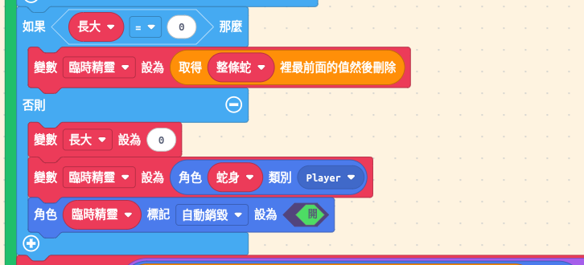

## 貪吃蛇規格表

| 項目         | 規格                                                     |
| :----------- | :------------------------------------------------------- |
| **遊戲名稱** | 貪吃蛇（Snake Game）                                     |
| **遊戲類型** | 益智遊戲（Puzzle Game）                                  |
| **開發平台** | Game:Bit 2.8 吋遊戲開發擴展板、Microsoft MakeCode Arcade |
| **遊戲角色** | 蛇頭（綠色）、蛇身（黃色）、食物（紅色）                 |
| **遊戲目標** | 用方向鍵控制蛇移動，吃到食物會變長；吃到 80 個食物即獲勝 |
| **基本玩法** | 按上下左右移動蛇，吃到食物加 1 分，蛇會變長 1 格         |
| **失敗條件** | 蛇碰到螢幕邊界或咬到自己                                 |
| **勝利條件** | 蛇的長度達到 80 格                                       |

## 核心設計概念

### 蛇是如何運作的？

#### 視覺魔術 🎩✨

在開始理解技術細節之前，先來看一個有趣的事實：

**「移動整條蛇」其實是個視覺假象！**

實際上每次移動時只發生三件事：

1. 🔴 **尾巴消失** - 最後一節身體不見了
2. 🟢 **頭部出現在新位置** - 前方出現新的頭部
3. 🟡 **中間的身體都沒動** - 所有中間節完全靜止

但因為這三件事**連續快速播放**，看起來就像整條蛇在移動！

```
動畫效果：
第 1 幀：□ ■ ■ ■ ■     尾巴在這
第 2 幀：  □ ■ ■ ■ ■   整條蛇好像往右移了！
第 3 幀：    □ ■ ■ ■ ■ 繼續往右！

實際情況：
第 1 幀：尾 身 身 身 頭
第 2 幀：   尾 身 身 頭(新)  ← 只有尾巴消失、新頭出現
第 3 幀：      尾 身 頭(新)  ← 中間的身體從未移動！
```

這個聰明的設計有什麼好處？

| 優點            | 說明                            |
| --------------- | ------------------------------- |
| ⚡ **超級高效** | 無論蛇多長，都只要移動 2 個精靈 |
| 💾 **省記憶體** | 不用每次都創建新精靈            |
| 🧠 **邏輯簡單** | 只要計算新頭的位置，不用管身體  |
| 🎮 **效能穩定** | 蛇長度不影響執行速度            |

:::tip[核心概念]
這就像電影的原理 —— 一張張靜止的畫面快速播放，創造出「動態」的錯覺！

蛇的移動也是一樣：只改變頭尾兩端，中間不動，但看起來整條蛇都在動！🐍✨
:::

#### 基本原理：陣列表示法

蛇的身體用一個**陣列**來表示，陣列中每個元素都是一個精靈（Sprite）：

```javascript
snake = [尾巴, 身體1, 身體2, 頭部]
          ↑                 ↑
       索引 0            索引 3
     第一個元素       最後一個元素
```

**關鍵概念：**

- 陣列的**第一個**元素（索引 0）= 蛇尾
- 陣列的**最後一個**元素 = 蛇頭
- 蛇的長度 = 陣列的長度

---

### 蛇的移動機制（重要！）

#### 情況 1：沒有吃到食物（正常移動）

使用「**移除尾巴 + 加入新頭**」的方法：

```
步驟 0（移動前）：
  陣列：[尾(8,8), 身1(24,8), 身2(40,8), 頭(56,8)]
  畫面：
    □ ■ ■ ■
    尾     頭

步驟 1：把舊頭部改成黃色身體
  snake[3].setImage(bodyImage)
  陣列：[尾(8,8), 身1(24,8), 身2(40,8), 身3(56,8)]
         黃      黃        黃        黃

步驟 2：移除尾巴（shift）
  mySprite = snake.shift()
  陣列：[身1(24,8), 身2(40,8), 身3(56,8)]
  移除的精靈：尾(8,8) → 會被重用！

步驟 3：計算新頭部位置（向右移動）
  新x = 56 + 16*1 = 72
  新y = 8 + 15*0 = 8

步驟 4：把移除的精靈設為綠色頭部並放到新位置
  mySprite.setImage(headImage)
  mySprite.setPosition(72, 8)

步驟 5：加入陣列尾端（push）
  snake.push(mySprite)
  陣列：[身1(24,8), 身2(40,8), 身3(56,8), 頭(72,8)]
         黃        黃        黃        綠

步驟 6（移動後）：
  畫面：
    . □ ■ ■ ■
        身  頭

  蛇向右移動了一格！長度不變！
```

**動畫展示（連續 3 步）：**

```
第 1 步：
  □ ■ ■ ■    陣列：[尾, 身1, 身2, 頭]
  尾    頭

第 2 步（向右）：
  . □ ■ ■ ■    陣列：[身1, 身2, 身3, 頭]
  舊尾 →   新頭

第 3 步（向右）：
  . . □ ■ ■ ■    陣列：[身2, 身3, 身4, 頭]
      舊尾 → 新頭
```

---

#### 情況 2：吃到食物（蛇變長）

**不移除尾巴**，而是建立新精靈：

```
步驟 0（吃到食物前）：
  陣列：[尾(8,8), 身1(24,8), 頭(40,8)]
  畫面：
    □ ■ ■ 🍎
    尾  頭 食物(56,8)

步驟 1：碰到食物，觸發 overlap 事件
  growth = 1  // 設定生長旗標

步驟 2：下一次移動時，檢查 growth
  if (growth == 0) {
      移除尾巴  ← 不執行
  } else {
      建立新精靈  ← 執行這個
      growth = 0
      mySprite = sprites.create(bodyImage, ...)
  }

步驟 3：計算新頭部位置
  新x = 40 + 16*1 = 56
  新y = 8 + 15*0 = 8

步驟 4：設定新精靈為綠色頭部
  mySprite.setImage(headImage)
  mySprite.setPosition(56, 8)

步驟 5：加入陣列
  snake.push(mySprite)
  陣列：[尾(8,8), 身1(24,8), 身2(40,8), 頭(56,8)]

步驟 6（吃到食物後）：
  畫面：
    □ ■ ■ ■
    尾    頭

  蛇變長了！從 3 格變成 4 格！
```

---

### 視覺對比：兩種情況的差異

```
正常移動（長度 = 3）：
  移動前：□ ■ ■ ■ . .    陣列長度：3
  移動後：. □ ■ ■ ■ .    陣列長度：3 (不變)
          ↑         ↑
        尾巴搬到    新頭
        這裡了

吃到食物（長度 3 → 4）：
  移動前：□ ■ ■ ■ 🍎    陣列長度：3
  移動後：□ ■ ■ ■ ■ .   陣列長度：4 (增加)
          ↑       ↑
        尾巴沒動  新頭
```

---

### 陣列操作詳解

#### `shift()` - 移除第一個元素

```javascript
let snake = [A, B, C, D];
let removed = snake.shift();

// 結果：
// snake = [B, C, D]
// removed = A

// 重點：removed 這個精靈還存在！可以被重用！
```

#### `push()` - 在最後加入元素

```javascript
let snake = [B, C, D];
snake.push(E);

// 結果：
// snake = [B, C, D, E]
```

#### 組合使用

```javascript
// 正常移動：
let tail = snake.shift()    // 移除尾巴
tail.setPosition(新位置)    // 改變位置
snake.push(tail)            // 加回陣列（變成新頭）
// 精靈總數不變！

// 吃到食物：
let newPart = sprites.create(...)  // 建立新精靈
newPart.setPosition(新位置)
snake.push(newPart)                // 加入陣列
// 精靈總數 +1！
```

---

### 顏色切換機制

為什麼需要切換顏色？

```
問題：如果不切換顏色
  移動前：[黃, 黃, 綠]
  加入新頭：[黃, 黃, 綠, 綠]  ← 兩個綠色頭部！

解決：每次移動前先把舊頭變黃
  步驟 1：[黃, 黃, 綠] → 把最後一個改成黃 → [黃, 黃, 黃]
  步驟 2：移除/建立精靈
  步驟 3：新精靈設為綠色
  步驟 4：[黃, 黃, 黃, 綠]  ← 只有一個綠色頭部！
```

**程式碼：**

```javascript
// 移動前：把舊頭改成黃色
snake[snake.length - 1].setImage(bodyImage);

// 移動後：把新頭設為綠色
mySprite.setImage(headImage);
```

---

### 完整流程圖

```
每 200ms 執行一次
    ↓
┌──────────────────────────────┐
│ 1. 舊頭部改成黃色身體         │
│    snake[最後].setImage(黃)   │
└──────────────────────────────┘
    ↓
┌──────────────────────────────┐
│ 2. 處理尾巴                   │
│    growth == 0?              │
│    ├─ 是：shift()移除尾巴     │
│    └─ 否：建立新精靈          │
└──────────────────────────────┘
    ↓
┌──────────────────────────────┐
│ 3. 計算新頭部位置             │
│    新x = 舊頭x + 16*速度x   │
│    新y = 舊頭y + 15*速度y   │
└──────────────────────────────┘
    ↓
┌──────────────────────────────┐
│ 4. 檢查碰撞                   │
│    ├─ 撞牆？→ 遊戲結束        │
│    └─ 咬到自己？→ 遊戲結束    │
└──────────────────────────────┘
    ↓
┌──────────────────────────────┐
│ 5. 設定新頭部                 │
│    mySprite.setImage(綠)     │
│    mySprite.setPosition(新位置)│
└──────────────────────────────┘
    ↓
┌──────────────────────────────┐
│ 6. 加入陣列                   │
│    snake.push(mySprite)      │
└──────────────────────────────┘
    ↓
┌──────────────────────────────┐
│ 7. 檢查勝利                   │
│    長度 == 80？→ 遊戲勝利     │
└──────────────────────────────┘
    ↓
暫停 200ms → 回到開頭
```

---

### 為什麼這個方法很聰明？

✅ **記憶體效率高**

- 正常移動時不創建新精靈，只是重用舊的
- 只有吃到食物才創建新精靈

✅ **程式碼簡潔**

- 不需要遍歷整個陣列移動每個身體
- 只操作頭和尾兩個元素

✅ **無精靈數量限制**

- 不會像其他方法一樣很快達到精靈上限
- 理論上可以長到 80 格以上

✅ **邏輯清晰**

- 陣列順序 = 蛇身順序
- 容易理解和除錯

---

### 關鍵概念總結

| 概念     | 說明                           | 程式碼                          |
| -------- | ------------------------------ | ------------------------------- |
| 蛇的表示 | 陣列，第一個是尾，最後一個是頭 | `snake = [尾, ..., 頭]`         |
| 正常移動 | 移除尾巴，加入新頭             | `shift()` + `push()`            |
| 吃到食物 | 不移除尾巴，直接加入新頭       | 跳過 `shift()`，只執行 `push()` |
| 精靈重用 | shift 移除的精靈可以重用       | `let tail = snake.shift()`      |
| 顏色管理 | 移動前改黃，移動後設綠         | `setImage()`                    |
| 長度變化 | 陣列長度 = 蛇的長度            | `snake.length`                  |

{/*  */}

:::tip[想一想]

- 如果不重用精靈，每次都創建新的會怎樣？
- 如果陣列順序反過來（頭在前，尾在後）程式碼要怎麼改？
- 如果一次吃到 2 個食物，growth 要設為多少？
- 為什麼用陣列比用分開的變數好？
  :::

---

## 實作

### 步驟 1：設定圖片與全域變數

#### 1-1：理解遊戲格子系統

在開始之前，先了解遊戲的格子系統：這個畫面，你打算切成幾格？

**MakeCode Arcade 螢幕大小：**

- 寬度：160 像素
- 高度：120 像素

**每個格子大小：**

- 寬度：16 像素
- 高度：15 像素

**為什麼用 16 x 15？**

```
X 軸（橫向）：
160 ÷ 16 = 10 格
座標：8, 24, 40, 56, 72, 88, 104, 120, 136, 152
公式：8 + 16 * n (n = 0~9)

Y 軸（縱向）：
120 ÷ 15 = 8 格
座標：8, 23, 38, 53, 68, 83, 98, 113
公式：8 + 15 * n (n = 0~7)
```

**為什麼起始座標是 8？**

- 每個精靈是 16x16 像素
- 精靈的座標是「中心點」
- 8 像素 = 16 像素的一半
- 所以 (8, 8) 是第一個格子的中心

**圖解：**

```
螢幕左上角 (0, 0)
    ↓
    ├─ 8 像素 ─┬─ 8 像素 ─┐
    │          │          │
    │    精靈中心點        │
    │       (8, 8)        │
    │          │          │
    └──────────┴──────────┘
        16 像素寬度
```

{/*  */}

:::tip[想一想]

- 為什麼不用 (0, 0) 而要用 (8, 8)？
- 如果改成 16x16 的格子（Y 軸也用 16）會怎樣？
- 為什麼螢幕可以剛好放下 10 x 8 個格子？
  :::

#### 1-2：建立蛇頭和蛇身圖片

首先建立蛇頭、蛇身的圖案，並設定所有需要的變數：


:::tip[想一想]

- 為什麼要分開蛇頭和蛇身的圖片？
- 如果圖片大小改成 8x8 會怎樣？
  :::

### 步驟 2：建立初始蛇身（兩格）

建立一個向右移動的蛇，初始長度為 2 格，都使用身體圖片：


**解釋：**

- 初始位置：尾巴在 (8, 8)，頭部在 (24, 8)
- 兩個身體之間相距 16 像素（一格）
- 先建立兩個身體
- **最後把陣列最後一個改成頭部**（這很重要！）

:::tip[想一想]

- 為什麼一開始沒有頭？
- 為什麼初始蛇身只有 2 格？
- 如果想要 3 格或 4 格怎麼改？
- 為什麼要最後才設定頭部？如果忘記這行會怎樣？
  :::

### 步驟 3：產生食物

建立一個函式來隨機產生食物，確保不會出現在蛇身上：

#### 3-1 建立一個名為「產生食物」的函式，並新增食物精靈


#### 3-2 產生位置 x, y, 並用 `while` 迴圈確保不與蛇重疊


#### 3-3 再迴圈內檢查是否與蛇重疊，直到找到空位置，並設定食物位置


#### 3-4 呼叫函式並初始化分數


**解釋：**

- 使用 `while` 迴圈確保食物不會出現在蛇身上
- 座標計算：`8 + 16 * n` 確保對齊格子

:::tip[想一想]

- 為什麼要用 `while` 迴圈？
- 如果蛇很長，會不會找不到空位？
  :::

### 步驟 4：方向鍵控制

#### 4-1：理解速度變數

在開始控制之前，先了解 `速度x` 和 `速度y` 的作用：

**速度變數的含義：**

| 變數值   | 速度 x | 速度 y |
| -------- | ------ | ------ |
| **向右** | 1      | 0      |
| **向左** | -1     | 0      |
| **向上** | 0      | -1     |
| **向下** | 0      | 1      |
| **靜止** | 0      | 0      |

**重要規則：**

- `速度x` 和 `速度y` **不能同時不為 0**（不能斜著走）
- 每次只能改變一個方向（上下左右其中之一）
- 遊戲開始時 `速度x = 1, 速度y = 0`（向右）

---

#### 4-2：用方向鍵改變速度

用方向鍵改變蛇的移動方向，並防止 180 度轉向：

**防止 180 度轉向的邏輯：**

- 向左/右移動時（速度 x != 0），不能再按左/右
- 向上/下移動時（速度 y != 0），不能再按上/下
- 例如：蛇正在向右走（速度 x = 1），按左鍵會被忽略

**檢查邏輯說明：**

| 目前方向 | 速度 x | 速度 y | 可以按的鍵 | 會被忽略的鍵 |
| -------- | ------ | ------ | ---------- | ------------ |
| 向右     | 1      | 0      | 上、下     | 左、右       |
| 向左     | -1     | 0      | 上、下     | 左、右       |
| 向上     | 0      | -1     | 左、右     | 上、下       |
| 向下     | 0      | 1      | 左、右     | 上、下       |


:::tip[想一想]

- 為什麼要防止 180 度轉向？
- 如果不防止會發生什麼事？
- 蛇可以原地不動嗎？
- 如何讓蛇可以 180 度轉向？
  :::

### 步驟 5：吃到食物

當蛇頭碰到食物時，加入音效並設定生長旗標：


**解釋：**

:::tip[想一想]

- 為什麼不直接在這裡加入新身體？
- `長大` 旗標在哪裡被使用？ (告訴移動邏輯「下次不要移除尾巴」)
  :::

### 步驟 6：蛇的移動邏輯（核心！）

使用 `重複無限次` 迴圈持續移動蛇，並加入立即碰撞檢測：

遊戲開始前暫停 2 秒


用無限迴圈持續執行以下步驟：


- 步驟 1：把舊頭部改成身體顏色
  - `整條蛇`最後一個元素（頭部）改成身體圖片
    
- 步驟 2：處理尾巴
  - 如果 `長大 == 0`（沒吃到食物），將尾巴(陣列第一個)除出，並指定為重用這個精靈
  - 否則（吃到食物），建立新身體精靈，並重置 `長大 = 0`
    
- 步驟 3：計算新頭部位置
  - 用目前頭部位置加上 `速度x` 和 `速度y`
    
- 步驟 4：檢查邊界碰撞
  - 用 x, y 判斷，如果新位置超出螢幕範圍，播放音效並結束遊戲
    
- 步驟 5：檢查咬到自己
  - 用迴圈檢查新位置是否與蛇身任何一部分重疊，如果有，播放音效並結束遊戲
    
- 步驟 6：設定新頭部（綠色）並加入陣列
  - 把重用的精靈設為頭部圖片，並設定位置，然後加入陣列尾端
    
- 步驟 7：檢查勝利條件
  - 如果蛇長度達到 80(最多也只能到 80)，結束遊戲並顯示勝利
- 步驟 8：暫停一段時間
  - 暫停 200 毫秒，可以從這裡調整遊戲速度
    

{/*  */}

:::tip[想一想]

- 為什麼要在設定位置「之前」檢查碰撞？
- 如果改成 `暫停(100)` 會怎樣？
  :::

## 變異與擴展

### 變異 1：改變遊戲速度

```javascript
// 在 forever 迴圈最後
pause(200); // 改成 150 = 更快，改成 300 = 更慢
```

### 變異 2：隨分數加速

```javascript
// 在 forever 迴圈最後
let speed = 200 - info.score() * 5; // 每吃一個快 5ms
if (speed < 50) speed = 50; // 最快 50ms
pause(speed);
```

### 變異 3：改變勝利條件

```javascript
// 改成吃到 50 個就贏
if (snake.length == 50) {
  game.over(true);
}
```

### 變異 4：加入特殊食物

```javascript
// 產生金色食物，吃到加 5 分
if (info.score() % 10 == 0) {
  // 每 10 分產生一個金色食物
}
```

### 變異 5：穿牆模式

```javascript
// 改成碰到邊界會從另一邊出現
if (x < 0) x = 160;
if (x > 160) x = 0;
if (y < 0) y = 120;
if (y > 120) y = 0;
```

## 進階挑戰

1. **隨機障礙物**：在地圖上加入不能通過的牆壁
2. **多種食物**：加入不同分數的食物（普通、金色、彩虹）
3. **時間限制**：加入倒數計時器
4. **雙人模式**：兩條蛇同時遊戲
5. **關卡系統**：通過一關後進入更難的下一關
6. **成就系統**：完成特定條件解鎖成就
7. **更多挑戰等你來設計！**

## 玩一下成品吧

{/* https://arcade.makecode.com/S42804-55773-36266-80094 */}

<div style="position:relative;height:0;padding-bottom:117.6%;overflow:hidden;">
  <iframe
    style="position:absolute;top:0;left:0;width:100%;height:100%;"
    src="https://arcade.makecode.com/---run?id=S42804-55773-36266-80094"
    allowfullscreen="allowfullscreen"
    sandbox="allow-popups allow-forms allow-scripts allow-same-origin"
    frameborder="0"
  ></iframe>
</div>
