## 太空侵略者規格表

| 項目         | 規格                                                              |
| :----------- | :---------------------------------------------------------------- |
| **遊戲名稱** | 太空侵略者（Space Invaders）                                      |
| **遊戲類型** | 射擊遊戲（Shoot 'em up）                                          |
| **開發平台** | Game:Bit 2.8 吋遊戲開發擴展板、Microsoft MakeCode Arcade          |
| **遊戲角色** | 太空船、子彈、外星人（敵人）、敵人子彈                            |
| **遊戲目標** | 操控太空船發射子彈，消滅所有外星人以獲得勝利，避免被敵人攻擊      |
| **基本玩法** | 玩家用方向鍵左右移動太空船，用 A 鍵發射子彈；每擊中敵人可得 10 分 |
| **難度提升** | 敵人會左右移動並逐漸下降，碰到邊界後會加速；敵人會隨機反擊        |
| **額外挑戰** | 限制子彈數量（一次只能一顆）、敵人抵達底部即失敗、三條生命        |

## 實作

### 步驟 1：太空船

1. 先設定好太空船角色
2. 把太空船放到畫面底部中央
3. 控制太空船的左右移動

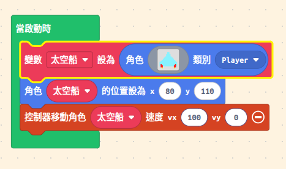

:::tip[想一想]

- 如何限制太空船只能在畫面底部移動？
- 太空船只能左右移動，不能上下移動
- 如何讓太空船不會超出畫面邊界？
  :::

### 步驟 2：玩家射擊系統

1. 建立自訂的 `武器` 種類
2. 設定生命值為 3，分數為 0
3. 按 A 鍵發射子彈
4. 限制一次只能發射一顆子彈

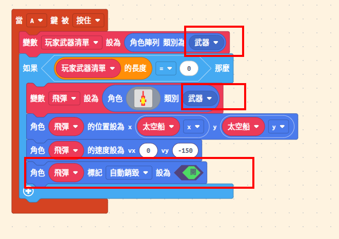

:::caution[注意]
為什麼要建立自訂的 `武器` 種類？因為我們需要區分玩家的子彈和敵人的子彈，這樣才能正確處理碰撞事件。

可以讓子彈飛出螢幕後自動銷毀。
:::

:::tip[想一想]

- 如何限制子彈的數量？
- 如何讓子彈從太空船的位置發射？
- 如何讓子彈往上移動？
- 子彈飛出螢幕後會發生什麼事？
  :::

### 步驟 3：外星人矩陣

1. 設定好外星人角色
2. 用雙重迴圈建立 7 欄 x 4 列共 28 個外星人
3. 每個外星人之間保持固定間距

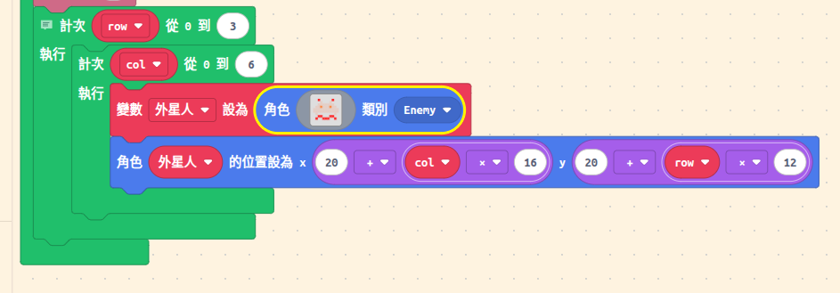

:::tip[想一想]

- 為什麼要用雙重迴圈？
- 如何計算每個外星人的位置？
- `20 + col * 16` 和 `20 + row * 12` 代表什麼意思？
- 如何改變外星人的間距？
  :::

### 步驟 4：讓外星人左右移動

#### 4-1：設定移動變數

首先，我們需要兩個變數來控制外星人的移動：

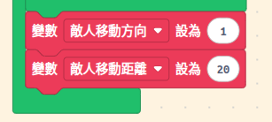

:::tip[想一想]

- 這 2 個區塊要放在哪裡？
- 為什麼用 1 和 -1 來代表方向？
- 如果改成 30 會發生什麼事？
  :::

#### 4-2：讓外星人動起來

我們先用每隔一段時間（500 毫秒 = 0.5 秒），讓所有外星人一起移動：

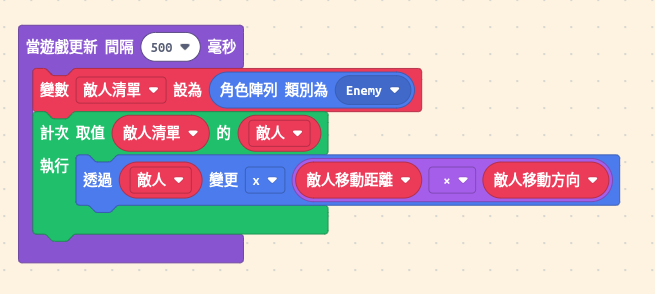

:::caution[測試看看]
現在執行遊戲，外星人會一直往右飛出螢幕！別擔心，我們接下來要加上邊界檢測。
:::

:::tip[想一想]

- 為什麼外星人會飛出螢幕？
- 如何讓外星人移動得更快或更慢？
  :::

### 步驟 5：外星人碰到邊界就下降

現在外星人會飛出螢幕，我們要讓它們：

1. 碰到右邊 → 往下移動一點，然後往左走
2. 碰到左邊 → 往下移動一點，然後往右走

#### 5-1：檢查外星人是否碰到「右邊界」

在 `當遊戲更新 間隔500毫秒` 裡面，移動程式碼的**下面**加上：

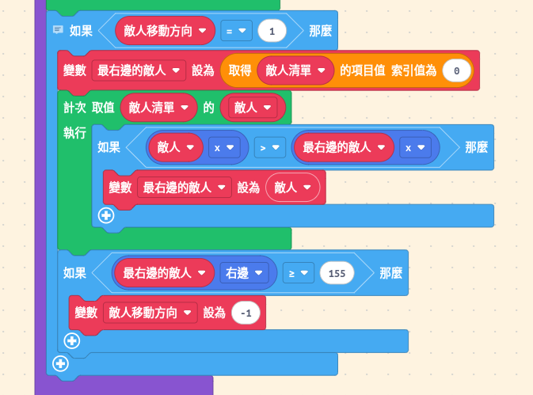

**解釋：**

1. **為什麼要找「最右邊」的外星人？**

```

👾👾👾👾👾👾👾 ← 如果外星人排成一列

```

只要最右邊的碰到邊界，整群就要轉向

2. **怎麼找最右邊的？**

- 先假設第一個是最右邊的
- 檢查每一個外星人，如果 x 座標更大，就更新「最右邊的」
- 最後就知道誰在最右邊了

3. **`最右邊的敵人.右邊` 是什麼？**

- 是外星人的「右邊緣」位置
- 螢幕寬度是 160，所以 155 是快要碰到右邊了

{/*  */}

:::tip[想一想]

- 如果有外星人被打掉了，會影響邊界檢測嗎？
- 為什麼是 155 而不是 160？
  :::

:::caution[測試看看]
現在執行遊戲，外星人會碰到右邊後往左走，但會一直往左飛出螢幕！繼續下一步。
:::

#### 5-2：檢查外星人是否碰到「左邊界」

繼續在剛剛的程式碼下面加上：

:::tip[偷吃步]

- 其實左邊界檢測和右邊界檢測很像，你可以直接複製貼上
- 只要把最右邊的變數改成最左邊的
- 再更改判斷條件即可
  :::

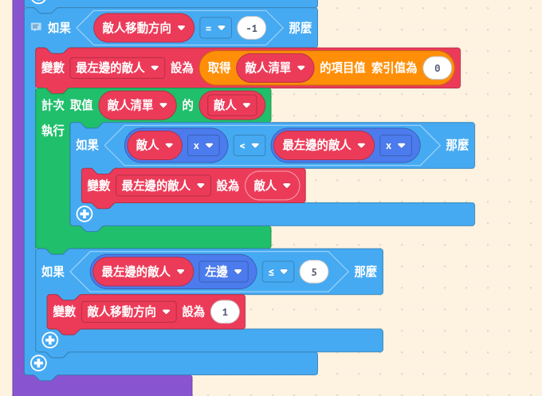

**解釋：**

- 和右邊界一樣的邏輯，只是方向相反
- 用 `<` 找最小的 x 座標（最左邊）
- 用 `.左邊` 檢查左邊緣
- `<= 5` 表示接近左邊界

:::caution[測試看看]
現在外星人會左右來回移動了！但它們不會下降。繼續下一步。
:::

#### 5-3：碰到邊界時，讓外星人「下降」

修改剛剛的程式碼，碰到邊界時不只改方向，還要讓外星人往下移動：

**修改右邊界部分：**

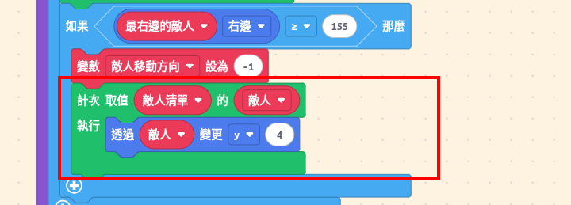

**修改左邊界部分：**

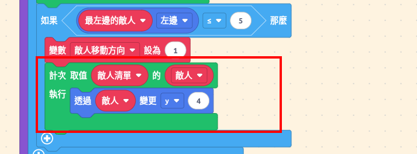

**解釋：**

- 所有外星人都要一起下降
- 4 個外星人下降 4 個像素

:::caution[測試看看]
現在外星人會左右移動，碰到邊界會下降了！但速度一直都一樣。繼續下一步讓它們加速。
:::

:::tip[想一想]

- 為什麼要用迴圈讓「所有」外星人下降？
- 4 這個數字可以改嗎？改大或改小會怎樣？
- 其實這 2 個區塊可以**合併**成一個，怎麼做？
  :::

#### 5-4：每次下降後，讓外星人「加速」

在下降的程式碼後面加上一行：

**修改右邊界部分：**

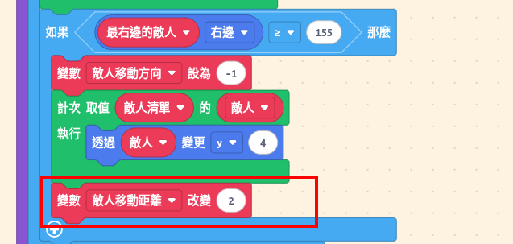

**修改左邊界部分：**
參考右邊

**解釋：**

- `敵人移動距離` 本來是 20
- `改變 2` 代表增加 2，變成 22
- 下次碰到邊界又增加 2，變成 24
- 外星人會越來越快！

:::caution[完成！]
現在外星人會：

- ✅ 左右移動
- ✅ 碰到邊界下降
- ✅ 越來越快

試著玩玩看，外星人是不是越來越難對付了？
:::

:::tip[想一想]

- 如何讓外星人不要加速？
- 如何讓外星人一開始就很快？
- 如何讓外星人不要下降？
  :::

### 步驟 6：擊中外星人

1. 當玩家子彈碰到外星人時
2. 外星人消失
3. 子彈消失
4. 分數增加 10 分

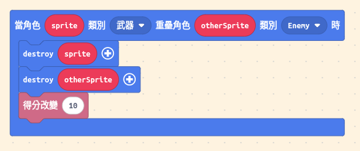

:::caution[注意]
注意參數，銷毀的對象要正確。
:::

:::caution[測試看看]
一直動，而且還會下降，很難測試，可以暫時把 500 毫秒改成 5000 毫秒，讓外星人移動變慢一點，方便測試。
:::

:::tip[想一想]

- 如何加入音效？
- 如何加入爆炸動畫？
  :::

### 步驟 7：外星人反擊

1. 每 2 秒隨機選擇一個外星人
2. 從該外星人位置發射子彈
3. 子彈向下移動

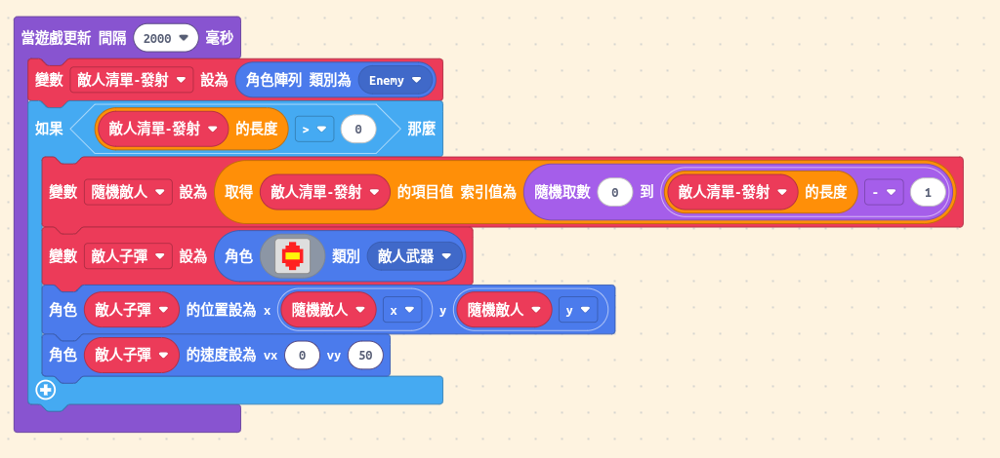

:::tip[想一想]

- 如何隨機選擇一個外星人？
- 如何讓敵人子彈從外星人位置發射？
- 如何讓敵人子彈往下移動？
- 如何調整敵人射擊的頻率？
- 如果外星人都被消滅了會怎樣？
  :::

### 步驟 8：被外星人擊中

1. 當敵人子彈碰到太空船時
2. 敵人子彈消失
3. 生命值減少 1

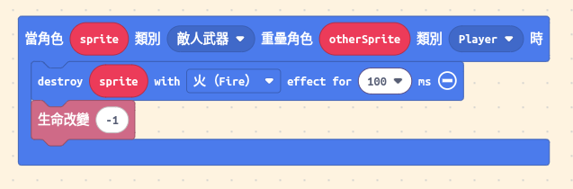

:::tip[想一想]

- 如何讓敵人子彈消失？
- 如何讓生命值減少？
- 生命值歸零會發生什麼事？
- 如何讓太空船閃爍？
- 如何加入無敵時間？
  :::

### 步驟 9：勝負判定

1. 檢查外星人是否抵達底部（失敗）
2. 檢查是否消滅所有外星人（勝利）
3. 生命值歸零（自動失敗）

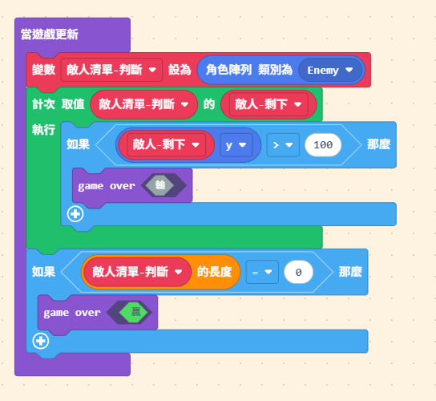

:::tip[想一想]

- 如何判斷外星人是否抵達底部？
- 如何判斷是否消滅所有外星人？
- 如何自訂遊戲結束畫面？
  :::

## 加些花樣

- 加入音效與特效
- 加入開始畫面

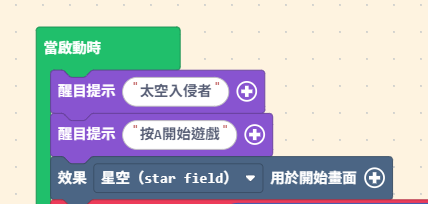

:::caution[注意]
遊戲還是要自己做一些調整，什敵人移動速度、下沈距離…等等
:::

## 挑戰任務

1. **掩體系統**：在玩家上方加入 4 個可破壞的掩體
2. **Boss 關卡**：消滅所有外星人後生成一個大型 Boss
3. **能量道具**：外星人被擊毀時有機率掉落道具（雙發子彈、護盾等）
4. **多關卡系統**：完成一波外星人後，生成更難的下一波
5. **高分紀錄**：使用 `settings` 模組記錄歷史最高分
6. **更多挑戰等你來設計！**

## 玩一下成品吧

<div style="position:relative;height:0;padding-bottom:117.6%;overflow:hidden;">
  <iframe
    style="position:absolute;top:0;left:0;width:100%;height:100%;"
    src="https://arcade.makecode.com/---run?id=S53915-31443-92145-55601"
    allowfullscreen="allowfullscreen"
    sandbox="allow-popups allow-forms allow-scripts allow-same-origin"
    frameborder="0"
  ></iframe>
</div>
