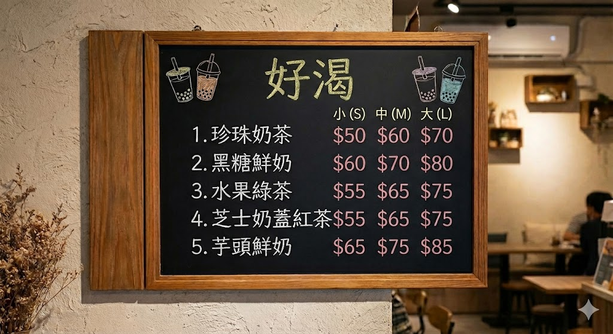

請用 **Google 表單**，打造你的「好渴」手搖飲線上訂購單

:::tip
善用 AI 把圖片中的字截取出來
:::

---

## 🛠️ 開始實作：Step-by-Step 指南

### 第一步：建立表單與基本資訊

1. 打開 **Google 雲端硬碟**，按「新增」、「Google 表單」
2. **表單標題**： `【好渴】校慶園遊會預購單`
3. **說明**:：`我是「資處五甲50王大同」，這是我的園遊會訂購表單`

#### 基本問題 (1)－收集姓名

- 點擊右側 **＋** 新增問題
- 內容：`班級 / 姓名`
- 題型：**簡答**
- 設定：開啟 **必填**

#### 基本問題 (2)－收集電話

- 新增問題
- 內容：`聯絡電話`
- 題型：**簡答**
- 設定：開啟 **必填**
- 防止亂填：
  `⋮ → 回應驗證 → 規則運算式 → 相符項目數`

:::tip
問一下 AI 電話號碼驗證：
`google 表單中的數字驗證，如果是電話 0919-012345 或 0919012345 這樣的格式，要怎麼做`
:::

---

### 第二步：設計主餐選單（多選格）

一次處理「飲料 + 尺寸」的對照矩陣。

- 題型：**多選格 (Multiple choice grid)**

**列（Rows）：**

- 珍珠奶茶
- 黑糖鮮奶
- 水果綠茶
- 芝士奶蓋紅茶
- 芋頭鮮奶

**欄（Columns）：**

- 小杯 (S)
- 中杯 (M)
- 大杯 (L)

---

### 第三步：自訂加料區（核取方塊）

- 題型：**核取方塊 (Checkboxes)**
- 內容：`額外加料（可多選）`

**選項：**

- 不加料
- 珍珠 (+$10)
- 椰果 (+$10)
- 布丁 (+$15)
- 奶蓋 (+$20)

---

### 第四步：甜度與冰塊（選擇題）

#### 甜度

- 題型：**選擇題 (Multiple choice)**
- 選項：
  - 正常糖
  - 七分糖
  - 半糖
  - 微糖
  - 無糖

#### 冰塊

- 題型：**選擇題**
- 選項：
  - 正常冰
  - 少冰
  - 微冰
  - 去冰
  - 溫熱

---

### 第五步：表單美化與預覽

1. 點擊右上角 🎨 **自訂主題**
2. 上傳或選擇標頭圖片
3. 點擊 👁 **預覽**，實際填寫測試流程

---

### 第六步：發佈

1. 發佈
2. 管理
3. 一般存取權：注意意一下，不要用學校的網域，選「知道連結的任何人」
4. 複製作答者連結
