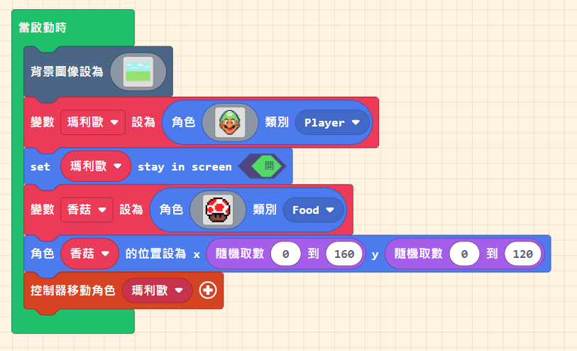

## 環境介紹

- [Game:Bit 2.8 吋 遊戲開發擴展板](https://www.icshop.com.tw/pages/circuspi-gamebit)
- [Microsoft MakeCode Arcade](https://arcade.makecode.com/)

## 流程

### 遊戲介紹

- 有 3 個角色：瑪利歐、香菇、烏龜
- 規則：移動瑪利歐去吃香菇，烏龜會去咬瑪利歐

### 角色設定

1. 先設定好角色，如圖 (你可輸入 **8 bits art**、**pixel art**，[瑪利歐圖像](/8bit-mario.pdf))
   
1. 把角色放到不同位置
   
1. 控制 **瑪利歐** 的移動
   

如果你沒畫完，可以直接選素材，或是你要用這 3 個角色，可以直接拷貝下面的程式碼：

```javascript
let 瑪利歐 = sprites.create(
  img`
    ..........fffff..........
    ........ff71117ff........
    .......f771717177f.......
    ......f77171717177f......
    .....f7771717171777f.....
    ....f777771111177777f....
    ....f777777777777777f....
    ...f77777777777777777f...
    ...f77777777777777777f...
    ..f77777ff44444ff77777f..
    ..f7777f44f444f44f7777f..
    ..f7ee4411144411144ee7f..
    ..f7ee4416f444f6144ee7f..
    ...f7e4418f444f8144e7f...
    ..f44e4418444448144e44f..
    ..f4f444444444444444f4f..
    ..f4f4fff4444444fff4f4f..
    ..f4444fff44444fff4444f..
    ...ff44ffff444ffff44ff...
    ....f4444f4ffff4f444f....
    .....f4444222222444f.....
    ......ff4442222444f......
    .......f444444444f.......
    ........f4444444f........
    .........f44444f.........
    ..........fffff..........
    `,
  SpriteKind.Player
);
let 香菇 = sprites.create(
  img`
    . . . . . f f f f f f . . . . . 
    . . . f f 2 2 1 1 1 1 f f . . . 
    . . f 2 2 2 2 1 1 1 1 2 2 f . . 
    . f 2 2 2 2 1 1 1 1 1 1 2 2 f . 
    . f 2 2 2 1 1 2 2 2 2 1 1 2 f . 
    f 1 1 1 1 1 2 2 2 2 2 2 1 1 1 f 
    f 1 2 2 1 1 2 2 2 2 2 2 1 1 1 f 
    f 2 2 2 2 1 2 2 2 2 2 1 1 1 2 f 
    f 2 2 2 2 1 1 2 2 2 2 1 1 2 2 f 
    f 1 2 2 1 1 1 1 1 1 1 1 1 2 2 f 
    f 1 1 1 f f f f f f f f 1 1 2 f 
    . f f f c c f c c f c c f f f . 
    . . f c e e f e e f e e c f . . 
    . . f e e e e e e e e e e f . . 
    . . . f e e e e e e e e f . . . 
    . . . . f f f f f f f f . . . . 
    `,
  SpriteKind.Food
);
let 烏龜 = sprites.create(
  img`
    . . . . . f f f f f f . . . . . 
    . . . . f f 7 7 7 7 f f . . . . 
    . . . f 7 7 f f f f 7 7 f . . . 
    . . f 7 7 f 7 7 7 7 f 7 7 f . . 
    . . f 7 f 7 7 7 7 7 7 f 7 f . . 
    . f 7 f 7 7 7 7 7 7 7 7 f 7 f . 
    . f f 7 f 7 7 7 7 7 7 f 7 f f . 
    . f 7 7 7 f 7 7 7 7 f 7 7 7 f . 
    f 7 7 7 7 7 f f f f 7 7 7 7 7 f 
    f f f 7 7 f 1 1 1 1 f 7 7 f f f 
    1 1 1 f f 1 1 1 1 1 1 f f 1 1 1 
    f 1 1 1 1 f f f f f f 1 1 1 1 f 
    . f f 1 1 1 1 1 1 1 1 1 1 f f . 
    . . . f 1 1 1 1 1 1 1 1 f . . . 
    . . . . f f 1 1 1 1 f f . . . . 
    . . . . . . f f f f . . . . . . 
    `,
  SpriteKind.Enemy
);
```

:::tip[想一想]

- 黑色背景很醜，可以自己加背景嗎？
- 角色的位置每次都一樣，可以不一樣嗎？
- 瑪利歐會跑出畫面，可以處理一下嗎？
  :::

:::note[如果你想加經典的背景音樂]

```javascript
music.play(
  music.createSong(
    hex`00b4000408020305001c000f0a006400f4010a00000400000000000000000000000000000000022a000000040001290400080001290c001000012914001800012518001c00012920002400012c30003400012008001c000e050046006603320000040a002d000000640014000132000201000224000000040001190400080001190c001000011914001800011918001c00011920002400012009010e02026400000403780000040a000301000000640001c80000040100000000640001640000040100000000fa0004af00000401c80000040a00019600000414000501006400140005010000002c0104dc00000401fa0000040a0001c8000004140005d0076400140005d0070000c800029001f40105c201f4010a0005900114001400039001000005c201f4010500058403050032000584030000fa00049001000005c201f4010500058403c80032000584030500640005840300009001049001000005c201f4010500058403c80064000584030500c8000584030000f40105ac0d000404a00f00000a0004ac0d2003010004a00f0000280004ac0d9001010004a00f0000280002d00700040408070f0064000408070000c80003c800c8000e7d00c80019000e64000f0032000e78000000fa00032c01c8000ee100c80019000ec8000f0032000edc000000fa0003f401c8000ea901c80019000e90010f0032000ea4010000fa0001c8000004014b000000c800012c01000401c8000000c8000190010004012c010000c80002c800000404c8000f0064000496000000c80002c2010004045e010f006400042c010000640002c409000404c4096400960004f6090000f40102b80b000404b80b64002c0104f40b0000f401022003000004200300040a000420030000ea01029001000004900100040a000490010000900102d007000410d0076400960010d0070000c80048000000010001040800090001040c000d0001041400150001041800190001042000210001042800290001042c002d0001043000310001043400350001043800390001043c003d000104`
  ),
  music.PlaybackMode.UntilDone
);
```

:::

### 下載到 Gamebit

1. 
2. 
3. 按下載 (如果沒有問你要下載到哪裡，記得去瀏覽器的設定更改)
4. 選擇位置

### 瑪利歐吃香菇

整理一下，我們目前的程式如下 (烏龜先放旁邊，它會變灰色，暫且不要理它)：


接著，我們要來處理瑪利歐吃香菇的部份：

1. 拉出重疊的積木
   
2. 當瑪利歐碰到香姑時，應該做幾件事：

- 加音效
- 香菇被吃了，在另一個地方又出現新的香菇
- 加得分
  

### 加點難度，加倒數

:::tip[想一想]

- 讓香菇移動
- 讓香菇撞到邊回彈
- 加入生命值
- 加入倒數 (倒數後，沒吃到香菇扣生命值，並加個效果)
  :::


### 再加上烏龜

:::tip[想一想]

- 加入烏龜
- 讓烏龜追著瑪利歐跑 (速度調小一點)
- 碰到烏龜扣生命值
  :::


### 實在是難

調整一下生命值，倒數值

- 不要難到玩家不想玩
- 也不要簡單到玩家覺得沒有挑戰性

### 遊戲結束


最後的最後，整個程式長這樣 [按我直看程式](https://arcade.makecode.com/S99066-99328-25476-35991)


