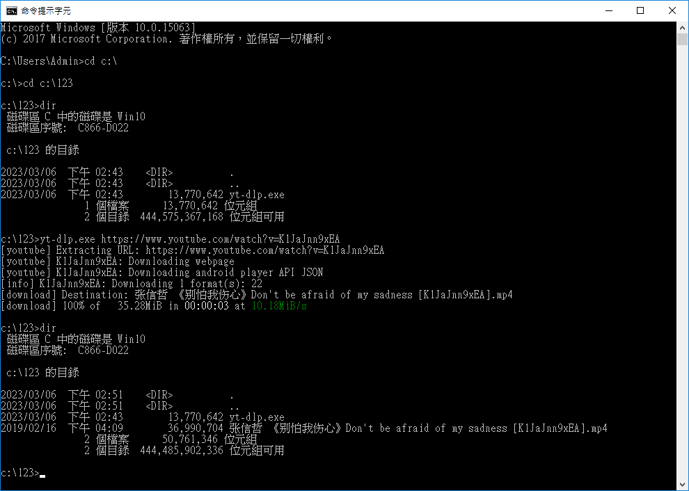

## 錄音

- 下載 youtube
  - 指令介面
    - 以前有一個 youtube-dl，但是，嗯，現在使用他的一個衍生軟體 [yt-dlp](https://github.com/yt-dlp/yt-dlp)
    - [[分享] 好軟體推薦-1 替代 youtube-dl 的解決方案](https://www.nvda.org.tw/discussion/ui=2004160143tm=2014581025)
    - cmd、[CMD 常用指令 | CYL 菜鳥攻略](https://dotblogs.com.tw/CYLcode/2018/09/13/102159)
    - 動作說明：
      - 在 c:\ 下新增一個「123」資料夾
      - 將 yt-dlp 下載到「c:\123」
      - 開啟「Windows 系統」->「命令提示字元」
      - 指令如下：
        
  - 圖形介面：[Stacher7](https://stacher.io/)
- 聲音分離 [Moises.ai](https://moises.ai/) (1 個月有 5 首免費額度)
- [Audacity](https://www.audacityteam.org/)、[Wavacity](https://wavacity.com/)
  - 麥克風有沒有聲音
  - 設定錄到新音軌
  - [Installing FFmpeg for Windows](https://lame.buanzo.org/ffmpeg64audacity.php)

## 編輯影片

- [CapCut](https://www.capcut.com/)。也可以下載 App 用手機操作
- 完成後，請上傳到 youtube，並分享連結
